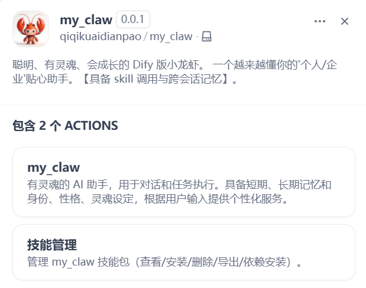
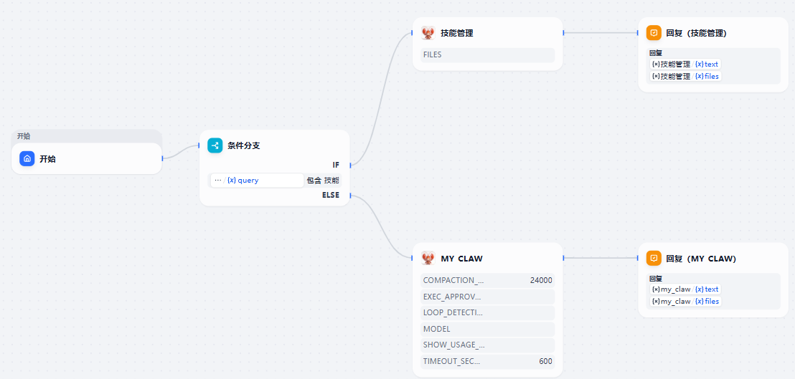
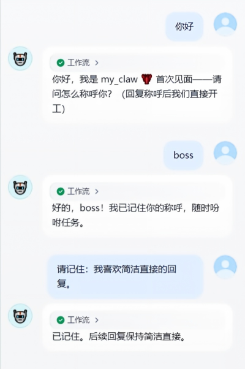
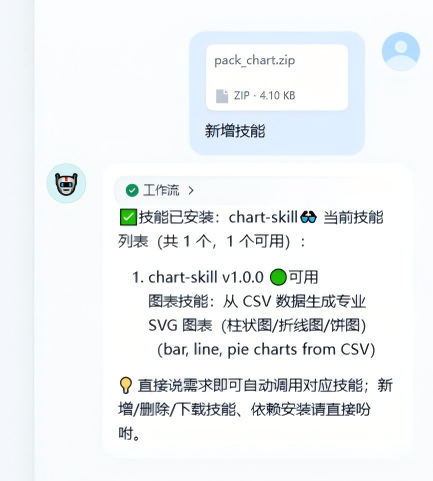

# my_claw

**Author:** qiqikuaidianpao
**Version:** 0.6.0
**Type:** Tool (Tool Plugin)

### Overview

my_claw is a little lobster with a soul on the Dify platform — an AI
companion with short-term and long-term memory, plus identity, personality
and soul settings. It aims to help you feel the warmth of AI: the more you
work with it, the better it knows you. Come and adopt a dedicated AI
assistant for yourself or your company.

my_claw follows the **Skill Progressive Disclosure** execution model: it
treats skill packs as a toolbox, so the agent reads a skill's manual only
when a task matches, then reads files and runs scripts as needed, finally
delivering text or files. Skills are hot-swappable — install or remove them
right in the chat. Skill packs follow the open **agentskills.io** standard
(a `SKILL.md` manifest needs just `name` + `description`), so packs built
for Claude/OpenAI-style agents work here too.

When a request is genuinely ambiguous, my_claw does not guess: it pauses
and shows 2-4 numbered options, then continues with the one you pick.
And its long-term memory is manageable in chat — list, edit or delete
remembered items by number, with a nightly "dream" pass that extracts
facts/preferences/experiences from yesterday's chats, merges duplicates
and archives stale ones.

### Use Cases

- You want a soulful AI assistant that remembers you and grows with daily use
- You want to build a dedicated assistant for yourself or your team, with its
  own identity and personality
- You want to extend its abilities by dropping in skill packs (documents,
  charts, schedules, group messages, and your own)
- You want an agent that asks a quick multiple-choice question instead of
  guessing when your request is ambiguous
- You want memory you can audit and curate — see what it remembers, delete
  or edit any entry, browse the archive

### Tools

This plugin provides two tools:

- **my_claw**: a soulful AI assistant for conversation and task execution. It
  has short-term and long-term memory, identity/personality/soul settings,
  and adapts to user input for personalized service.
- **Skill Manager**: manages the skills directory. You can view / install /
  remove / export skills, and run dependency checks & installation.

  

### How to Use (in Dify)

1. Install this plugin from the marketplace (or from a local `.difypkg` file).
2. For self-hosted users: set `FILES_URL` in Dify's `.env` to your Dify
   address (restart Dify afterwards), otherwise Dify may not be able to
   fetch uploaded files.
3. Build a workflow like the example below — route messages that contain
   "skill" to **Skill Manager**, everything else to **my_claw**:

   

4. Chat with my_claw and set up a persona — tell it your name and
   preferences once, and it remembers across sessions:

   

   Tip: send `reset persona` to clear identity and memory and
   start over.

   Memory is manageable in chat (Chinese commands): list memories, delete
   memory No. N, edit memory No. N, browse archived experiences. Questions
   like "do you remember my birthday" are answered normally — they are
   never mistaken for management commands. Each night my_claw also digests
   yesterday's conversations into typed memory entries (fact / preference /
   experience), and when entries pile up past 30 it consolidates: merges
   duplicates, keeps the newer side of conflicts, and archives experiences
   untouched for 60+ days (original backed up first, nothing silently
   deleted).

5. Use Skill Manager to extend my_claw with custom tools — upload a skill
   pack (.zip) and say "install skill". Skills support
   view / add / delete / export, availability checks and dependency
   checks/installation:

   

   A skill pack is a directory (zipped) with a `SKILL.md` front-matter
   manifest:

   ```yaml
   ---
   name: my-skill
   description: What this skill does
   read-when: When the agent should load this skill
   metadata:
     requires:
       bins: [python3]
   ---
   # Instructions for the agent ...
   ```

   Feature: built-in dependency detection and installation. The agent is no
   longer allowed to install dependencies by itself — declare dependencies
   in the `metadata` of `SKILL.md` instead of the body, and run
   `dependencies` to install what can be installed automatically.

   Feature: compatible with OpenClaw's skill directory structure — standard
   skills with YAML front-matter metadata work out of the box.

### Troubleshooting

- **No visible reply** with some models: the provider plugin must support
  function calling / tool use; switching models or upgrading the provider
  plugin usually fixes it.
- **Skill not invoked**: the more complete the skill package, the smoother
  the invocation — make sure files and scripts follow the standard format
  above.

### Author & Contact

- Repository: <https://github.com/qiqikuaidianpao/my_claw>
- Contact: open a GitHub issue in the repository above.

### Development

```bash
pip install -r requirements.txt pytest
pytest tests/ -q          # kernel unit tests (no Dify needed)
python scripts/package.py # build my_claw.difypkg
```

The agent core is platform-agnostic (zero SDK imports, fully unit-tested);
Dify is an adapter, so other hosts are possible.

### Provenance & License

Apache-2.0. my_claw is a modernized, re-architected fork of
[mini_claw](https://github.com/lfenghx/mini_claw) v1.2.0 by lfenghx,
re-released with the original author's blessing. Attribution and per-module
provenance are recorded in [NOTICE](NOTICE).
